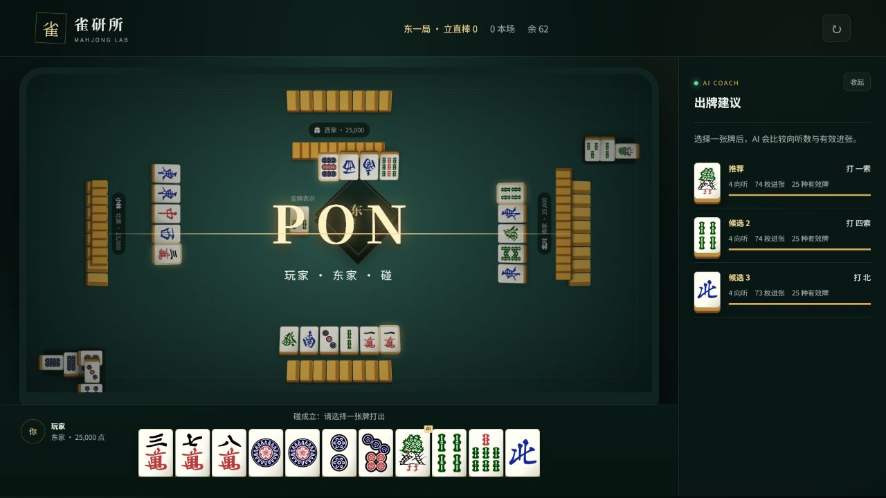

# 雀研所 · game_mahjong

一款在浏览器中运行的单机日麻训练小游戏，将四麻/三麻实战、标准计分与 AI 牌效提示结合起来。





## 当前功能

- 四人麻将与三人麻将牌组
- 普通模式与 AI 教练模式
- 一局战、东风战与半庄战
- 标准日麻牌面、真实牌山、摸牌、弃牌和四家独立牌河
- 荣和、自摸、立直、两立直、一发、荒牌流局与流局满贯
- 玩家与 AI 均可吃、碰；玩家支持大明杠与杠后补牌
- 牌桌右下悬浮操作台：立直、荣和、自摸、吃、碰、杠使用独立高对比配色
- 副露牌组、被鸣牌的牌河移除、鸣牌优先级及一发消除
- 副露向听数、开放役降番、明刻与明杠符数计算
- 胡牌演出：明确显示和牌者、荣和/自摸、放铳者、完整牌型、役种、符、番和点数
- 两段式胡牌演出：先聚焦和牌座位并显示荣和/自摸，再淡入结算界面
- 每小局点数移动页：逐笔显示点数由谁支付给谁，并动态更新四家排名
- 常见一至六番役、役满和双倍役满判定
- AI 对手决策，以及前三候选切牌、向听数与进张分析
- 响应式 2.5D 桌面与移动端界面

当前版本已支持吃、碰和大明杠。暗杠、加杠、抢杠、多家同时荣和、连庄与杠宝牌翻开仍在后续计划中。

## 牌面资源

牌面使用 [FluffyStuff/riichi-mahjong-tiles](https://github.com/FluffyStuff/riichi-mahjong-tiles) 的 Regular 标准日麻 SVG 资源。该项目将牌面素材声明为 Public Domain，原始许可与来源说明保存在 `assets/tiles/`。

## 运行

项目没有生产依赖，请使用静态服务器打开：

```bash
npx serve .
```

由于使用 ES Modules，不建议直接通过 `file://` 双击 `index.html`。

## 测试

需要 Node.js 20 或更高版本：

```bash
npm test
```

## 后续方向

1. 加入暗杠、加杠、抢杠与完整振听规则
2. 增加连庄、本场棒、杠宝牌与流局听牌罚符
3. 增加局况和排名期望值分析
4. 生成针对个人弱项的复盘题
5. 加入牌谱导入与回放

## License

游戏代码采用 MIT License；牌面资源许可见 `assets/tiles/LICENSE.md`。
